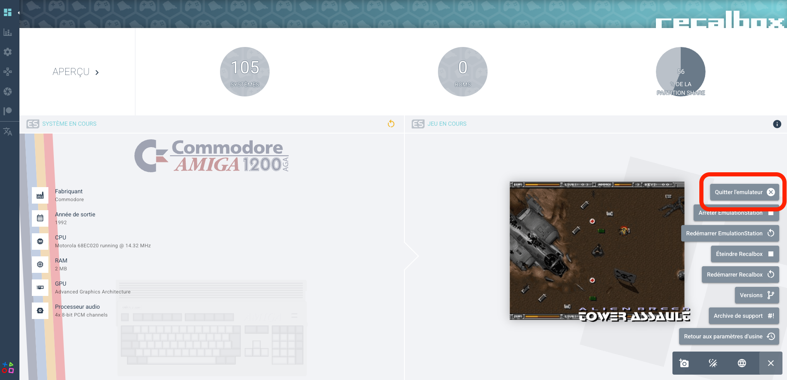

# webmanager-addon — Custom Actions for the Recalbox Web Manager

A Recalbox userscript that extends the native web manager (port 20666) with custom action buttons, powered by a micro HTTP API server.

## Overview

| | |
|---|---|
| **Version** | 1.0 |
| **Author** | LeCED |
| **Contact** | noxious@caramail.fr |
| **License** | Free to use and modify |
| **Recalbox** | 10.0 |
| **Tested on** | Raspberry Pi 5 |

## Current Add-ons

### Kill Emulator

Useful when a game is frozen or you want to exit without physical access to the controller.



## Installation

Deploy `webmanager-addon[start](sync).py3` to your Recalbox — see [How to install a userscript](../../INSTALL-SCRIPTS.md).

Reboot or restart EmulationStation. No modification to `recalbox.conf` is required.

## Uninstallation

Deploy `uninstall-webmanager-addon[start](sync).py3` to your Recalbox — see [How to install a userscript](../../INSTALL-SCRIPTS.md).

Reboot or restart EmulationStation. The script will:
- Stop and remove the daemon (init.d script + PID file)
- Remove the generated server script and the webmanager-addon userscript
- Restore the original web manager frontend files from squashfs
- Delete itself

## How it works

The script does two things at every EmulationStation startup:

1. **Installs a micro HTTP API server** (Python, port 8081) that exposes custom action endpoints. The server runs as a daemon via an init.d script (`S30webmanager-addon`) so it survives ES restarts.

2. **Patches the web manager frontend JS** to inject buttons into the gear menu. The patch targets `MainLayout-*.js` in `/recalbox/web/manager-v3/assets/` and is re-applied at each boot to survive Recalbox updates.

### API Endpoints

| Endpoint | Description |
|---|---|
| `GET /api/kill-emulator` | Graceful stop then force kill current emulator |
| `GET /api/status` | Check if an emulator is running (returns PIDs) |
| `GET /` | Mini standalone web UI |

The mini UI is also accessible directly at `http://recalbox.local:8081/`.

### Recognized Emulators

The server dynamically loads the list of emulator binaries from `configgen.recalboxFiles.recalboxBins` at startup. This means the list is always up to date with the installed Recalbox version, regardless of the hardware platform.

## Compatibility

> **This script was written and tested exclusively on Raspberry Pi 5 running Recalbox 10.0.**
>
> It should work on all architectures since the emulator list is loaded dynamically from configgen, but this has not been tested.
>
> The frontend patch targets specific patterns in the minified JS bundle. Different Recalbox versions may use different filenames or code patterns. If the patch fails, the script logs a warning and continues — the API server still works via the mini UI.

## File structure

### On the host (this repo)

```
webmanager-addon/
├── webmanager-addon[start](sync).py3    # The userscript (all-in-one)
├── uninstall-webmanager-addon[start](sync).py3  # Uninstall userscript (one-shot, self-deleting)
└── README.md                            # This file
```

### On the Recalbox (created by the script)

```
/recalbox/share/userscripts/
├── webmanager-addon[start](sync).py3          # Userscript
└── webmanager-addon-server.py                 # Micro API server (generated)

/etc/init.d/S30webmanager-addon                # Daemon init script (generated)
/recalbox/web/manager-v3/assets/MainLayout-*.js  # Patched frontend
```

## Changelog

### v1.0 — Initial release
- Micro HTTP API server with kill-emulator and status endpoints
- Frontend patch injecting "Kill Emulator" button in gear menu
- Mini standalone web UI on port 8081
- SIGTERM + 3s grace period + SIGKILL kill sequence
- Init.d daemon for persistence across ES restarts
